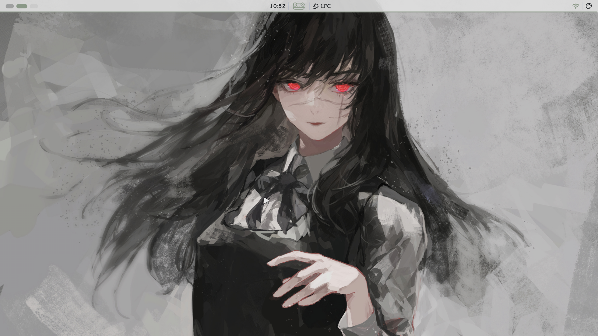
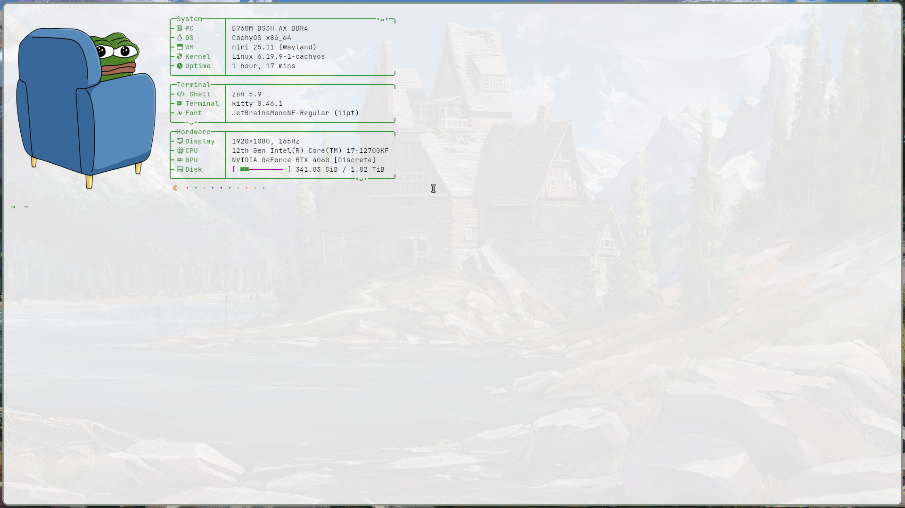
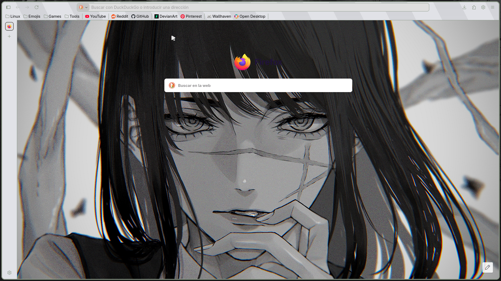
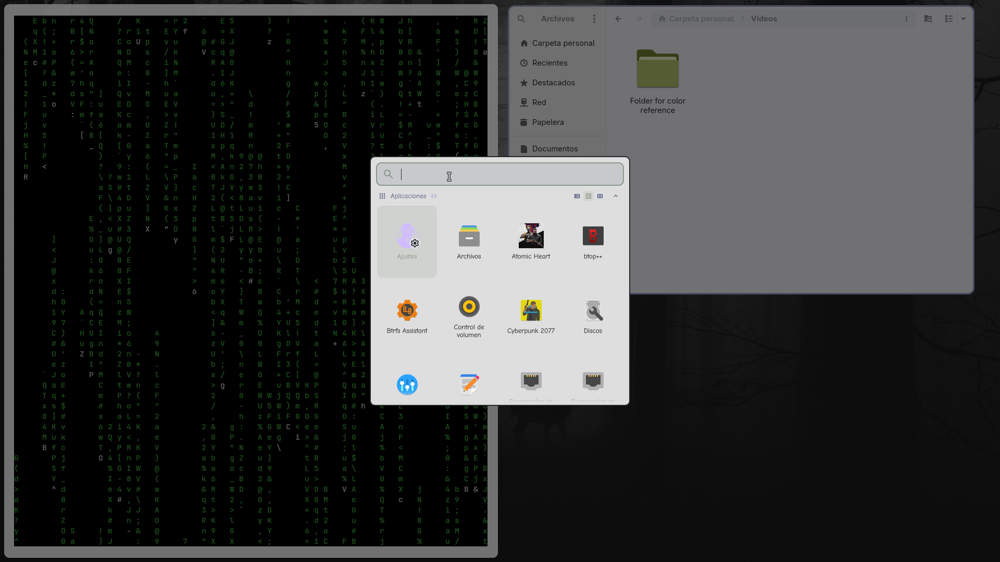

# ➤ NIRI GREEN RICE 🐸

If you like Niri and light-coloured themes, this guide is for you. I’ve been looking for themes, fonts, backgrounds… All this to achieve a sleek, fluid and polished look for a functional desktop. If you like a blend of style and practicality, this layout could serve as a starting point for creating your own.

## ➜ Features

- Detailed step-by-step customisation guide
- Configuration files
- Wallpapers
- Some tips

## ➜ Preview

**Desktop:**

**Terminal:**

**Firefox:**

**App Launcher:**

To see more, go to the Preview folder

## ➜ Installation

My recommendation is to install everything from scratch and start without a desktop environment; however, you can use the Niri dotfiles that come pre-installed with your distro (in my case, CachyOS comes pre-configured, but I did a fresh install). Now, if you use that preset, it will likely come with Waybar or another alternative other than the one we’re going to use here, so you’ll simply need to change which you want to use in your Niri settings.

What we’ll be using is Dank Material Shell, a full-featured desktop environment that uses Quickshell. It has a modern interface, allowing you to configure a wide range of settings, apply themes, and synchronise colors. It also includes all the standard desktop features such as notifications, the control centre, and the lock screen... To ensure you install everything correctly, I recommend using the official DMS guide, as if I were to write it here myself, I might leave things out, include something incorrect, and ultimately an official guide is always much better.

**Guide:** https://danklinux.com/

I found this video helpful too, so I'm sharing the link in case anyone else finds it useful: 

**Video:** https://www.youtube.com/watch?v=1wHBUihASWU

**Note:** I know that even though the title says ‘installation’, it doesn't actually mention installing the components, but I should point out that it's very easy to follow the official guide or, if you prefer, the video. Have a look and you’ll see that it really is simple to follow the step-by-step instructions. And finally, the best thing, at least for me, was to read the whole wiki and then watch the video alongside it.

---

Right then, once you’ve installed DMS and checked that everything is working, we can move on to customisation

## ➜ Customization

Right, I think personalisation is a personal and unique thing; everyone has their own style, and obviously, many of us may share the same one. But that doesn’t mean you can’t ‘copy’, or rather, take ideas from other users. Personally, I spend hours browsing Reddit for ideas. That’s why I want to share mine too, to help others, like me, who want to personalise their desktop.

### › Themes

Let’s start with the basics: themes. DMS comes with a graphical settings interface that allows you to download themes from its repository. 

1. Press the `Super + Space` keys to open the app launcher
2. Open the Settings app
3. Go to the Theme and colors section
4. In the Explore section, look for the themes you like best (I use Petrichor)

#### ★ My Theme Configuration

- **Theme:** Petrichor
- **Accent Color:** Green 🐸
- **Automatic Color Mode:** Off
- **Color Mode**: Light Mode On

#### ★ My Widgets Styles Configuration

- **Widget Style:** Base
- **Control Center Tile Color:** Primary
- **Button Color:** Primary
- **Popups Transparency**: 100%
- **Corner Radius:** 12 px

#### ★ Niri design cancellations

- **Close Loopholes:** On
- **Window Spacing:** 8 px
- **Clear Corner Radius:** Off
- **Override Border Size**: On
- **Edge thickness:** 3 px

*(Options not listed are left at default)*

---

### › Cursor Theme

Another key feature is the cursor. Personally, I think the default one is a bit ugly, so I swapped it for the Material Cursor, which looks really nice, and the hand when you hover over clickable items is really cool. Still, just use whichever one you like best.

Installing them is very simple:

1. Create a folder called `icons` in `/.local/share/`
2. Extract the downloaded files inside
3. In the same themes window, look for the cursor and replace it with your own. You can change its size and make it disappear when you type

- **Material Cursor:** https://www.opendesktop.org/p/1346778
- **Website for Cursors:** https://www.opendesktop.org/browse?cat=107&ord=latest

---

### › Custom Matugen Templates

The Custom Matugen Templates section is designed to apply themes to specific applications; in my case, I’ve left it at the default settings, except for Kitty, which is my terminal, and where I use Kitten themes.

---

### › Icon Theme

For the icons, I recommend Papirus and Papirus Gruvbox folders, but you can use whichever ones you prefer. Save the files to the folder you created earlier for the cursors. To change the theme, simply look at the bottom of the same window where you’ll find the icons section.

- **Papirus:** https://github.com/PapirusDevelopmentTeam/papirus-icon-theme
- **Papirus Folders:** https://github.com/xelser/gruvbox-papirus-folders
- **Website for Icons:** https://www.opendesktop.org/browse?cat=132&ord=latest

---

### › Fonts

Let’s move on to the fonts; I generally use Comic Neue, and then JetBrains for Kitty. To install new fonts, you need to create a folder, named `fonts` in the directory `/.local/share/`.

- **Comic Neue:** https://fonts.google.com/specimen/Comic+Neue?preview.script=Latn
- **JetBrains:** https://fonts.google.com/specimen/JetBrains+Mono

---

### › Dank Bar

Now for another key feature: the Dank Bar. Personally, I only have it visible in empty workspaces or when I have floating apps open, and when I hover the cursor over it. That way, I have the whole screen to myself for my main app, with no distractions or anything like that. 

It might sound funny, but to check the time I’ve got a €2 clock from IKEA that fits onto the stand of my monitor; it looks pretty cool, and that way I can check the time whenever I want, haha. Here’s the link so you can see what it looks like and how it fits onto the monitor stand, haha.

**IKEA Clock:** https://www.ikea.com/es/es/p/kupong-despertador-negro-90621811/

#### Settings

Right, although I don’t see the taskbar most of the time, it’s useful to have a few things, like the workspaces, the clock and weather, and the menu for Wi-Fi, sound, etc... Not to mention the colour palette, which works really well for customising and picking colours.

So here are my settings:

#### Visibility:

  - **Hide automatically:** On
  - **Hide options when windows are open:** On
  - **Show/Hide manually:** On
  - **Click Through:** Off
  - **Show overview:** Off

#### Space:

  - **Gap between edges:** 0%

#### Font size:

- **Font size:** 150%

#### Bar transparency:

- **Bar transparency:** 90%

#### Corners and backgrounds

  - **Square corners:** On
  - **No Background:** On
  - **Maximize Widget Icons:** On
  - **Maximize Widget Text:** Off
  - **Remove Widget Padding:** Off
  - **Gothic corners:** Off

#### Border

  - **Color:** Primary
  - **Opacity:** 100%
  - **Thickness:** 3 px

*(Options not listed are left at default)*

#### Widgets

The widgets are arranged in order.

1. **Left section**
- **Spacer:** 5
- **Workspaces**
---
2. **Central Section**
- **Clock**
- **Separator**
- **Spacer:** 15
- **Apps Launcher**
- **Spacer:** 15
- **Separator**
- **Weather**
---
1. **Right section**
- **Control Centre** 
- **Separator**
- **Colour Picker**
- **Separator**

---

### App Launcher

The app launcher is pretty cool; to open it, press Super + Space. Another way is from the bar if you have the widget. I’ve got it, but just for the look of it (I know I don’t always have the bar visible, but the frog adds a nice touch). So, let’s get on with my settings:

I can’t say much about the settings here; you can change the size, add a border, etc. But I do recommend the following plugins, which you can install from the ‘Add-ons’ section in the settings.

#### Plugins

- **Calculator:** Allows you to perform mathematical operations in the launcher
- **Dank Launcher Keys:** This shows you the DMS keybinds

---

### Wallpaper Carousel

Esto es otro plugin que permite cambiar de fondos de manera dinamica como un carrusel, como bien indica el nombre, y es bastante bonito.

---

## Additional Customization

- **Steam:** [Steam Guide](./Steam/Steam.md)
- **Kitty:** [Kitty Guide](./Kitty/Kitty.md)
